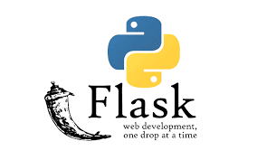
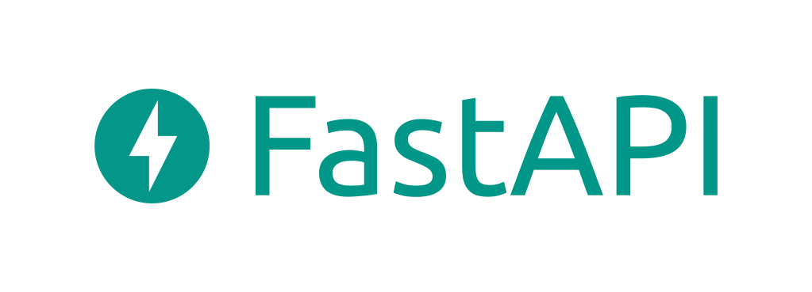
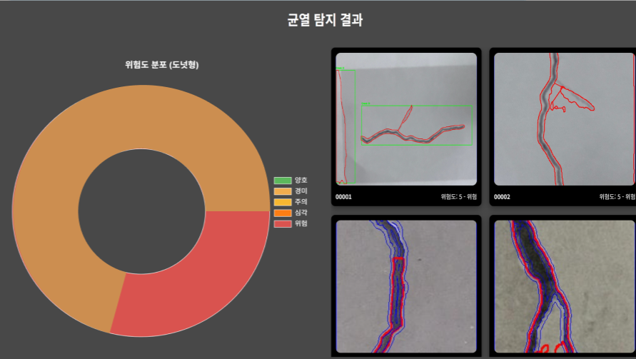

# 스위트홈 (SweetHome)
RC카를 활용한 균열(크랙) 탐지 및 위험도 분석 시스템  
**개발 기간:** 2024.09.02 ~ 2025.05.10  
**개발 인원:** 홍승범, 이민용, 문경한  
**캡스톤 전시회:** 2024.12.03, 2025.06.04

---

## 📍 프로젝트 소개

**스위트홈**은 RC카와 카메라를 활용하여 건축물 내 균열(크랙)을 실시간 촬영 및 분석하고, 위험도를 자동 분류하여 시각적으로 제공합니다.  
좁은 공간, 사람의 접근이 어려운 환경에서도 유연하게 사용 가능하도록 설계되었습니다.

---

## 🔧 사용 기술 스택

| PostgreSQL | VSCode | Flask | FastAPI |
|------------|--------|-------|---------|
|  |  |  |  |

---

## 기존 문제점

- 하자 확인을 위해 사람이 직접 방문해야 하고, 스티커 부착 후 2차 분석이 필요함
- 사람이 들어가기 어려운 곳에서 하자 파악이 어려움
- 주관적인 판단 기준으로 인해 하자 판별의 신뢰성 부족

---

## 해결 방법

- RC카로 크랙을 촬영하여 사진을 서버로 전송하고, 딥러닝 모델이 위험도 자동 분석
- 도넛 차트를 활용해 위험도를 시각적으로 표현
- RC카를 사용함으로써 좁은 공간에서도 손쉬운 접근 가능

---

## 기대 효과

- **인건비/시간 절감**으로 효율적인 점검 가능
- **접근 어려운 공간에서도 분석 가능** → 현장 적용성 증가
- **실시간 모니터링** → 빠른 대응 가능
- **정밀 주행 데이터 확보** → 데이터 일관성 유지
- **위험도 분석 제공** → 사용자 신뢰도 증가

---

## 아쉬웠던 부분

- 크랙 깊이 및 가벽 유무 판별 기능 구현의 어려움
- 광각 카메라 사용 시 화이트 노이즈 문제
- 웹 대시보드가 로컬 환경에서만 작동

---

## 🖼시스템 구성 이미지

### 크랙 촬영 UI

### 균열 분석 결과

---

## 전시회 일정

- 1차 캡스톤 전시회: 2024.12.03  
- 2차 캡스톤 전시회: 2025.06.04

---
